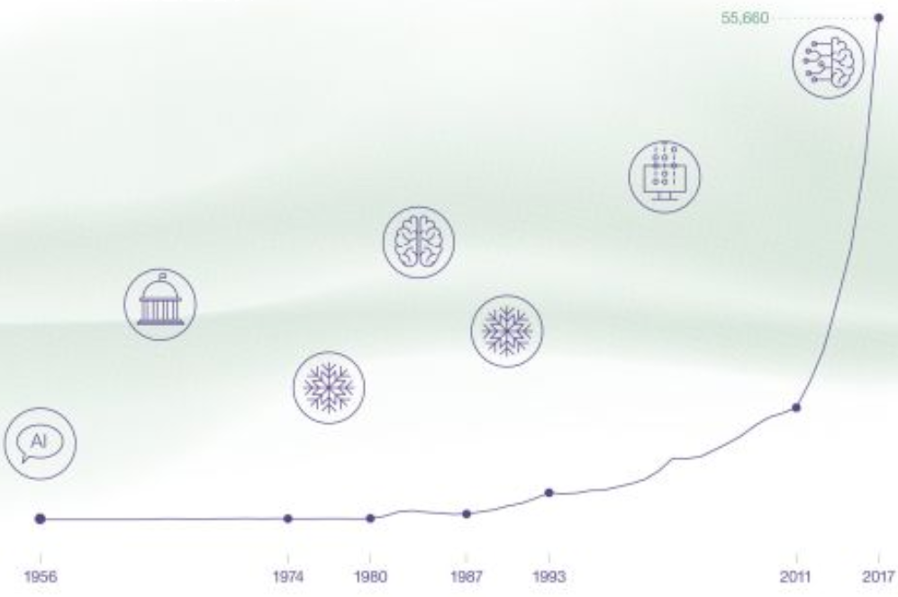

# 人工智能

## 人工智能史

1956年的达特矛斯会议上，组织者之一的约翰·麦卡锡说服了其他与会者，将『人工智能』作为本领域的名称。在这次会议上，AI 的名称和任务得以确定，因此这一事件被广泛承认为 AI 诞生的标志。

早期的人工智能大致分为两种流派，一种是基于逻辑学，另一种是基于统计的机器学习。1969 年，明斯基证明了『异或』问题是无法用单层感知器解决的，对神经网络的研究销声匿迹了将近十年。所以在早期，人工智能被用于证明数学定理、解决代数应用题等领域，并取得了很多成果。

到了 70 年代，研究者们遭遇了无法克服的基础性障碍。首当其冲的便是计算机有限的内存和处理速度不足以解决任何实际的 AI 问题，逻辑学也不能很好地判断常识和进行推理。莫拉维克悖论指出，『让计算机具有人类所独有的高阶智慧能力，比如推理、感知和行动能力是及其困难的』。AI 进入了第一次寒冬。

在 80 年代，由于计算机性能的提高，机器学习开始焕发新生，决策树、随机森林、支持向量机以及由于Hopfield 神经网络和反向传播算法的出现而重获新生的神经网络让研究者在推理、模式识别、语音识别等方面取得了很大的突破。

在 2006 年，神经网络之父—— Geoffrey Hinton 使用 Deep Boltzmann Machines 较好地解决了深层网络训练中梯度消失的问题，至此开启了深度学习的浪潮。2012 年， 首次采用 ReLU 激活函数解决梯度消失问题，添加Dropout层减小过拟合的 AlexNet 模型在 ImageNet 图像识别比赛中一举夺得冠军，且正确率远超第二名，引起了很大的轰动，使得CNN成为在图像识别分类的核心算法模型，带来了深度学习的大爆发。2016 年，Google 的围棋人工智能 AlphaGo 与围棋世界冠军、职业九段选手李世石进行人机大战，并以4:1的总比分获胜。

## 深度学习

CNN 的经典模型 AlexNet 的提出无疑是近年来人工智能领域最大的突破。目前只有机器学习才能够较好地完成『识别』与『推理』的任务。从 2012 年微软展示的一个同声传译的系统，到 2015 年底，微软亚洲研究院的研究员使用残差网络取得了当时图象识别比赛上面最好的成绩，再到 2016 年初，Google 的 AlphaGo 系统以 4：1 打败了围棋世界冠军李世石，这些项目的背后都有深度学习的技术作支撑。可以说，人工智能的第三波浪潮和深度学习是分不开，是 AlexNet 在图像识别比赛中的一骑绝尘，让研究者们意识到了深度学习的实用性与潜力。

此外，硬件能力的突破也无疑促进了深度学习的应用，短短几年间，神经网络的层数从几十层到几百层再到上千层，深度学习训练的模型越来越大，同时能够获取的算力也越来越丰富。

## 浪潮还是泡沫？

我认为，泡沫与否应该从两个角度来考虑。

从工业界的角度来讲，尽管对算力、数据标注、大模型的要求对深度学习的进一步发展和普及带来了一些制约因素，但不可否认的是，深度学习在这几年已经被广泛应用在计算机视觉、语音识别、自然语言处理等领域，取得了非常好的效果，并早已落地应用。

如今，很多云服务提供商都提供了 AI 开放平台，提供了各种 API ，让使用者能够享受深度学习带来的技术进步。此外，TensorFlow，PyTorch 等开源机器学习库降低了开发者的学习门槛。

而从投资的角度来说，目前的 AI 无疑是存在泡沫的。很多传统方向的公司为了获得投资，纷纷披上了人工智能的外衣，几乎所有初创企业都要蹭 AI 的热点。投资额逐年增高，然而项目落地却越来越难。2018 年全年，近 90% 的人工智能公司处于亏损状态。

## 总结

回顾过去 50 余年计算机各领域的发展，我认为一个领域与今天的人工智能高度相似，那就是计算机网络。

计算机网络在上世纪九十年代发展迅速，在工业界的巨额投资和人们对未来的期望下，万维网在短短十余年间发生了翻天覆地的变化。1989 年，万维网才被发明，十年后，web 网页就已数以亿计。在这期间，也产生了『互联网泡沫』，这一时期的标志是通常被称为『 .com 』的互联网公司不断成立。公司可以简单地通过在他们名字上添加『 e- 』前缀或是『 .com 』的后缀来使其股票价格增长。2000 年 3 月，泡沫破裂，大部分投资以失败收场，但优秀的互联网公司，比如 Google, Amazon ，生存了下来。他们改变了世界。

在技术方面，万维网与深度学习同样有着相似之处。如今，普通人几乎不需要任何知识便能在互联网上遨游，人们不需要知道自己浏览的页面背后的 HTML, CSS, JavaScript 长什么样，也不需要任何关于 Https 的知识。对于开发者来说，普通的开发者只需要 `import express from 'express'`就能实现一个非常简单的服务端。而这一切也正发生在 AI 领域。
