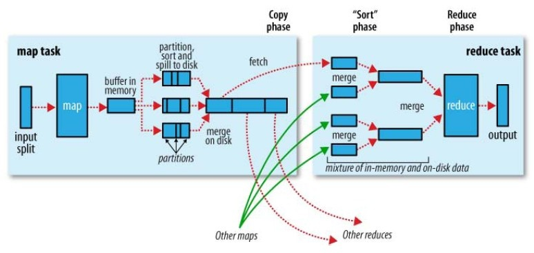

# 大数据
「大数据」是一种处理数据的方法，用于分析由于太大、太复杂而无法由传统的数据处理程序处理的数据集，并系统地从中提取信息。

可以用三个 V 来揭示大数据与传统数据处理的不同：

* 体积（Volume） -  大数据与数量有关。数据量正在以前所未有的速度增长。据估计，全球每天将创建 2.5 万亿字节的数据，到2020年将增长到 40ZB ，这比 2005 年增加了 300 倍。企业将在存储设备和服务器上拥有 TB 甚至 PB 的数据。
* 速度（Velocity） -   数据量增长越来越快，需要的处理速度和响应时间也越来越快 。其原因一方面是随着移动互联网的发展，被创造的数据越来越多，另一方面是因为能够处理的数据类型也越来越多，以往没有「价值」的数据也被收集并对其分析。
* 多样性（Variety）-  传统的数据方式是从一个地方收集数据并以一种格式传递，通常保存在关系型数据库里。但现在，非传统形式的数据，例如社交媒体上的视频，文本，pdf 和图形，以及嵌入式设备的数据正在被大规模采集。工作人员需要做更多的工作对其进行处理，并且需要更多的分析技能才能整理这些数据。

大数据首先要面临的挑战就是体积。当要处理的数据大到内存装不下了，大到一台计算机存储和处理不了，就需要引入复杂的并行和分布式计算技术了 。最常见的处理技术就是 Map-Reduce 了，其过程可分为读取，拆分，将拆分后的数据映射（map）成新的 key-value 对，重新分组，合并（reduce）分组后的键值对，输出

大数据会完全改变大众的生活和企业开展业务的方式。几乎所有行业都使用某种形式的大数据技术来优化业务。

1. 零售业
	
	零售业是当今高度依赖大数据的行业。简而言之，如果零售商不了解他们的客户，他们将努力在市场上取得成功。从大数据中获得的分析对于零售公司而言是无价的。此类信息可确保零售商能够更好地了解他们的客户，以便更精准地推荐用户可能喜欢地商品。
	
	大数据和分析在零售中可以以多种方式使用，最常见的莫过于分析客户行为。依靠收集信息，零售商能够为客户创造个性化的体验。零售商还可以使用大数据来预测消费者将要购买的商品。
	
2.  医疗服务业
    大数据已在医疗行业广泛使用。专业设备可以跟踪疾病的生命体征，并根据大数据建立地模型进行诊断。可穿戴技术还可以实时地收集人体的健康数据，为医护人员提供有关患者的重要信息，例如病人是否正在服药以及是否遵循服药安排。

    大数据可为医生提供了大量信息，而这些信息是他们从简单的面对面诊断中无法获得的。

3.  运输业
    大数据分析在运输业中有着广泛的应用前景。铁路调度可以理解为一个比较「完美」的大数据应用实例。调度中心能够收集正在运行的列车的速度、位置的信息并进行分析，以实现铁路调度（实际上铁路是依靠列车时刻表来实现列车调度的）。

    推而广之，大数据在运输业最典型的应用莫过于使用卫星导航和传感器来实时跟踪卡车，飞机或轮船。 使用公开的信息，例如道路状况，交通拥堵，天气状况，送货地址，加油站的位置，来优化卡车，飞机或轮船的路线，并实时推送给驾驶员。

    传感器还可以实时提供有关卡车、轮船或飞机的实时信息，并与监视发动机和设备运行状况的传感器相结合，预测故障和损坏程度，依次来缩短维护时间和减少浪费。